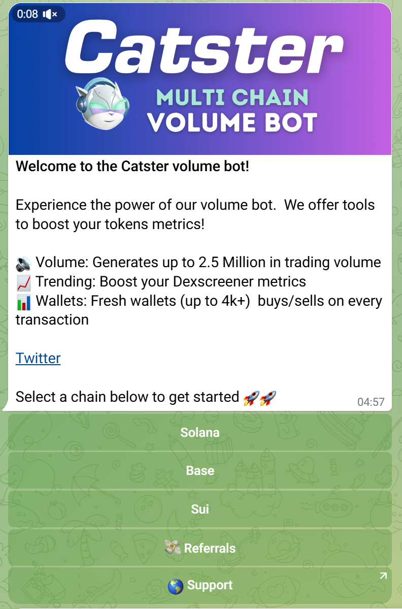

# How can I boost the volume of token on multichain?
# Multichain Volume Bot

This volume bot distribute SOL to multiple wallets and buy and sell with that distributed wallets permanently on the any platform.



## Contact Info

Telegram: @mineme0812

You can always feel free to find me here for my help on other projects.

## Features

- **Automated Wallet Creation**: Create number of wallets automatically to buy and sell the token
- **Automated SOL Distribution**: Distributes SOL to those new wallets.
- **Endless Buy and Sell Swaps**: Buy and Sell with those wallets permanently.
- **Configurable Parameters**: Allows customization of buy amounts, intervals, distribution settings, and more.
<!--
- **Massive Buy Mode**: Enables the configuration of multiple wallets for large-scale buy operations.
- **Sell Mode**: Gradually sells all tokens in sub-wallets through small transactions.
- **Token Pair Settings**: Configurable token mint and pool ID for swap operations.
-->
<!--
## Environment Variables

The bot uses the following environment variables, which should be defined in a `.env` file:

```env
PRIVATE_KEY=                 # Private key for the main wallet
RPC_ENDPOINT=                # RPC endpoint for Solana
RPC_WEBSOCKET_ENDPOINT=      # RPC WebSocket endpoint for Solana

####### BUY SETTING #######
IS_RANDOM=true               # Enable random buy amounts
DISTRIBUTION_AMOUNT=0.01     # Amount of SOL to distribute to each wallet
BUY_AMOUNT=0.01              # Fixed buy amount
BUY_UPPER_AMOUNT=0.002       # Upper limit for random buy amount
BUY_LOWER_AMOUNT=0.001       # Lower limit for random buy amount

BUY_INTERVAL_MAX=2000        # Maximum interval between buys in milliseconds
BUY_INTERVAL_MIN=4000        # Minimum interval between buys in milliseconds

CHECK_BAL_INTERVAL=3000      # Interval to check wallet balances in milliseconds
DISTRIBUTE_WALLET_NUM=8      # Number of wallets to distribute SOL to

SWAP_ROUTING=true            # Enable swap routing

###### FOR MASSIVE BUY #####
WALLET_NUM=8                 # Number of wallets for massive buy operations

########## FOR SELL MODE ##########
SELL_ALL_BY_TIMES=20         # Number of times to sell all tokens in sub-wallets gradually
SELL_PERCENT=100             # Percentage of tokens to sell from the main wallet

#### TOKEN PAIR SETTING ####
TOKEN_MINT=6VbEGuqwhjdgV9NxhMhvRkrFqXVNk53CvD7hK3C3yQS9  # Token mint address
POOL_ID=null                  # Pool ID for the token pair

TX_FEE=10                    # Transaction fee
ADDITIONAL_FEE=0.006         # Additional fee (should be larger than 0.006 SOL)
JITO_KEY=                    # Jito key
JITO_FEE=                    # Jito fee
BLOCKENGINE_URL=ny.mainnet.block-engine.jito.wtf  # Block engine URL

###### GENERAL SETTING ######
LOG_LEVEL=info               # Logging level (info, debug, error)
```
-->

## Usage
1. Clone the repository
```
git clone https://github.com/Takhi77/Solana-raydium-volume-bot.git
cd Solana-raydium-volume-bot
```
2. Install dependencies
```
npm install
```
3. Configure the environment variables

Rename the .env.copy file to .env and set RPC and WSS, main wallet's secret key, and jito auth keypair.

4. Run the bot

```
npm run start
```

## 🚀 Version 1

- ✅ **Transferring SOL to new wallet**: After buying and selling in one wallet, it transfers SOL to a newly created wallet and continues buying and selling there.
- ✅ **Maker increase**: New wallets are created every round of buying and selling, increasing the number of makers.
- ✅ **Sell before gather**: When gathering, if there are tokens left in the wallet, it sells the tokens first and gathers only SOL (the token account rent of 0.00203 SOL is reclaimed).
- ✅ **More buys than sells**: It randomly buys twice with SOL in the wallet and sells all tokens after some time, making the number of buys twice as many as sells, thus creating more buy pressure.

# Version 2 is developed and it is private repository.

## 🚀 Version 2
- ✅ **Provide Volmue Boost on telegram**: The Volume Boost has got you covered!
- ✅ **Provide Rank Boost on telegram**: The Rank Boost will pump these metrics to super-boost your token's ranking on Dex Screener:
- ✅ **Support Mulitchain(Solana, Base and Sui)**


